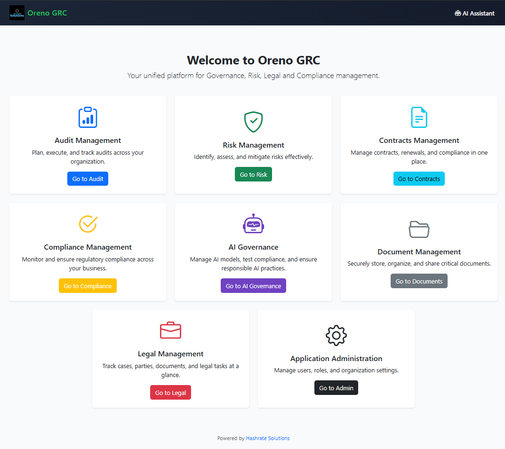
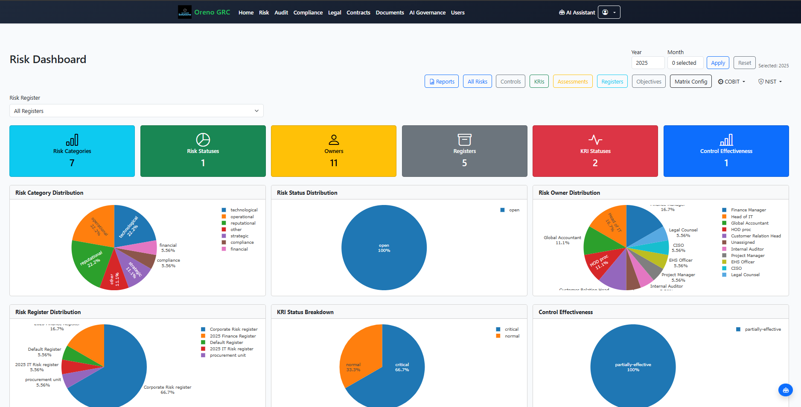
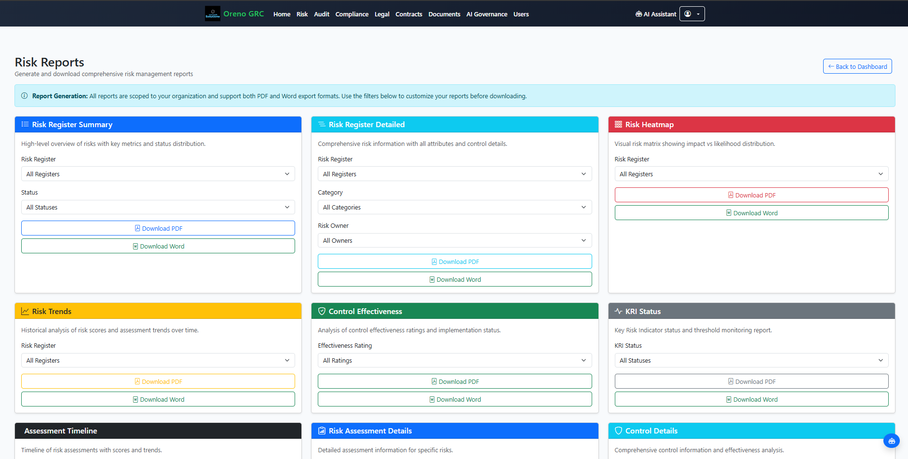

# Oreno GRC v2

<div align="center">
  
  
  [](https://opensource.org/licenses/MIT)
  [](https://python.org)
  [](https://djangoproject.com)
  [](CONTRIBUTING.md)
  
  **A comprehensive, open-source Governance, Risk, and Compliance (GRC) platform**
  
  [Documentation](https://oreno.tech/docs/) • [Contributing](CONTRIBUTING.md) • [Issues](https://github.com/oumafreddy/oreno/issues) • [Discussions](https://github.com/oumafreddy/oreno/discussions)
</div>

---

Oreno GRC is a modern, multi-tenant Governance, Risk, and Compliance platform built with Django. Designed for organizations of all sizes, it provides comprehensive tools for audit management, risk assessment, compliance tracking, and AI governance - all within a secure, scalable architecture.

<div align="center">
  
  <p><em>Oreno GRC Homepage</em></p>
</div>

## ✨ Key Features

- 🏢 **Multi-Tenant Architecture** - Isolated data per organization using `django-tenants`
- 🤖 **AI Governance** - EU AI Act compliance, NIST RSF, and OECD guidelines integration
- 🔍 **Risk-Based Auditing** - Global Internal Audit Standards (GIAS) 2024 compliant
- 📊 **Advanced Analytics** - Comprehensive reporting and dashboard capabilities
- 🔐 **Enterprise Security** - OTP authentication, JWT tokens, and advanced security features
- 📱 **Modern UI** - Responsive design with Bootstrap 5 and modern JavaScript
- 🔌 **REST API** - Full API support for integrations and custom applications

## 🚀 Quick Start

### Prerequisites
- Python 3.11+
- PostgreSQL (recommended) or SQLite
- Git

### Installation

1. **Clone the repository**
   ```bash
   git clone https://github.com/oumafreddy/oreno.git
   cd oreno
   ```

2. **Create virtual environment**
   ```bash
   python -m venv .venv
   source .venv/bin/activate  # On Windows: .venv\Scripts\activate
   ```

3. **Install dependencies**
   ```bash
   pip install -r requirements.txt
   ```

4. **Configure environment**
   ```bash
   cp env.example .env.oreno
   # Edit .env.oreno with your configuration
   ```

5. **Run migrations**
   ```bash
   python manage.py migrate --settings=config.settings.development
   or
   python manage.py migrate --settings=config.settings.tenants
   ```

6. **Create superuser**
   ```bash
   python manage.py createsuperuser --settings=config.settings.development
   ```

7. **Start development server**
   ```bash
   python manage.py runserver --settings=config.settings.development
   or
   python manage.py runserver --settings=config.settings.tenants
   ```

Visit `http://localhost:8000` to access the application.

## 🏗️ Architecture Overview

Oreno GRC follows a modular, multi-tenant architecture designed for scalability and maintainability:

### Core Components

- **Multi-Tenant Architecture** - Uses `django-tenants` for complete data isolation per organization
- **Custom User Model** - Enhanced authentication with OTP support and advanced security
- **AI Integration** - Local LLM support via Ollama with OpenAI fallback
- **REST API** - Comprehensive API with JWT authentication and rate limiting

### Application Modules

| Module | Description | Key Features |
|--------|-------------|--------------|
| 🔍 **Audit** | Audit lifecycle management | GIAS 2024 compliance, risk-based auditing, workplan management |
| ⚠️ **Risk** | Risk management system | Risk registers, matrices, KRIs, assessment workflows |
| ✅ **Compliance** | Regulatory compliance | Framework management, policy tracking, obligation monitoring |
| 📋 **Contracts** | Contract lifecycle | Contract types, parties, milestones, execution tracking |
| 📄 **Document Management** | Secure document handling | Upload, versioning, access control, audit trails |
| 🏢 **Organizations** | Multi-tenant management | Tenant isolation, user associations, subscription management |
| 👥 **Users** | Authentication & authorization | Custom user model, OTP, role-based access control |
| 🤖 **AI Governance** | AI compliance & governance | EU AI Act, NIST RSF, OECD guidelines, model registration |
| ⚖️ **Legal** | Legal document management | Legal frameworks, compliance tracking, document management |
| 📊 **Reports** | Analytics & reporting | Dashboard, custom reports, data visualization |

### Visual Showcase

<div align="center">
  
  <p><em>Audit Dashboard - Comprehensive audit lifecycle management with GIAS 2024 compliance</em></p>
</div>

<div align="center">
  
  <p><em>Risk Management - Risk registers, matrices, KRIs, and assessment workflows</em></p>
</div>

<div align="center">
  
  <p><em>Reports and Analytics - Advanced reporting and dashboard capabilities</em></p>
</div>

## 📁 Project Structure

```
oreno/
├── 📁 apps/                    # Django applications
│   ├── 🔍 audit/               # Audit management
│   ├── ⚠️ risk/                # Risk management  
│   ├── ✅ compliance/          # Compliance tracking
│   ├── 📋 contracts/           # Contract management
│   ├── 📄 document_management/ # Document handling
│   ├── 🏢 organizations/        # Multi-tenant management
│   ├── 👥 users/               # Authentication & users
│   ├── 🤖 ai_governance/       # AI governance features
│   ├── ⚖️ legal/               # Legal management
│   ├── 📊 reports/             # Reporting & analytics
│   └── 🔧 core/                # Common utilities
├── 📁 config/                  # Django configuration
│   ├── settings/              # Environment-specific settings
│   ├── urls.py                # URL routing
│   └── wsgi.py                # WSGI configuration
├── 📁 services/               # External integrations
│   ├── ai/                    # AI service integration
│   └── workflows/             # Workflow automation
├── 📁 templates/              # HTML templates
├── 📁 static/                 # Static assets (CSS, JS, images)
├── 📁 tests/                  # Test suites
├── 📄 requirements.txt        # Python dependencies
├── 📄 manage.py               # Django management script
└── 📄 README.md               # This file
```

## 🧪 Testing

### Run Tests
```bash
# Run all tests
python manage.py test --settings=config.settings.development
python manage.py test --settings=config.settings.tenants

# Run specific app tests
python manage.py test apps.audit --settings=config.settings.development
python manage.py test apps.audit --settings=config.settings.tenants

# Run with coverage
coverage run --source='.' manage.py test --settings=config.settings.development
coverage run --source='.' manage.py test --settings=config.settings.tenants
coverage report
```

### Test Coverage
- Unit tests for models and views
- Integration tests for workflows
- API endpoint testing
- Security testing

## 🚀 Deployment

### Production Setup
1. Configure production settings
2. Set up PostgreSQL database
3. Configure Redis for caching
4. Set up Celery for background tasks
5. Configure static file serving
6. Set up SSL certificates

### Docker Support (Optional)
Docker configuration is provided for convenience but is not required for development:

```bash
# Build and run with Docker (requires Docker installed)
docker-compose up --build
```

**Note**: Docker is optional. You can run Oreno GRC directly with Python without Docker.

## 🤝 Contributing

We welcome contributions! Please see our [Contributing Guide](CONTRIBUTING.md) for details.

### Ways to Contribute
- 🐛 Bug reports and fixes
- ✨ New features
- 📚 Documentation improvements
- 🧪 Test coverage
- 🎨 UI/UX enhancements
- 🌍 Translations

## 📄 License

This project is licensed under the MIT License - see the [LICENSE](LICENSE) file for details.

## 🙏 Acknowledgments

- Django community for the excellent framework
- Contributors to django-tenants for multi-tenancy support
- All contributors and users of Oreno GRC

## 📞 Support

- 📖 [Documentation](https://oreno.tech/docs/)
- 💬 [Discussions](https://github.com/oumafreddy/oreno/discussions)
- 🐛 [Issue Tracker](https://github.com/oumafreddy/oreno/issues)
- 📧 Email: fredouma@oreno.tech | oumafredomondi@gmail.com

---

<div align="center">
  <strong>Built with ❤️ by the Oreno GRC Team</strong>
</div>
