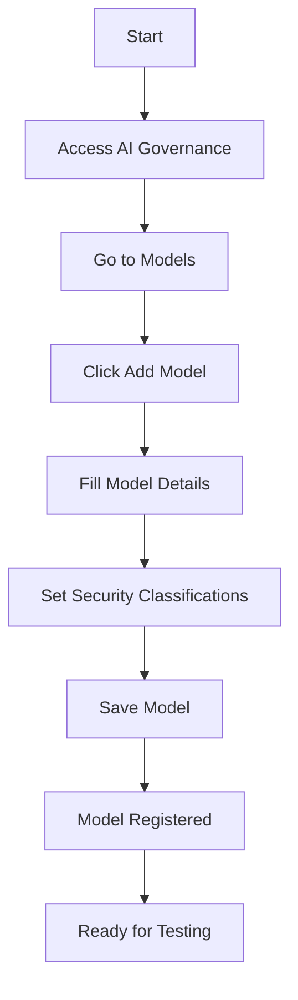
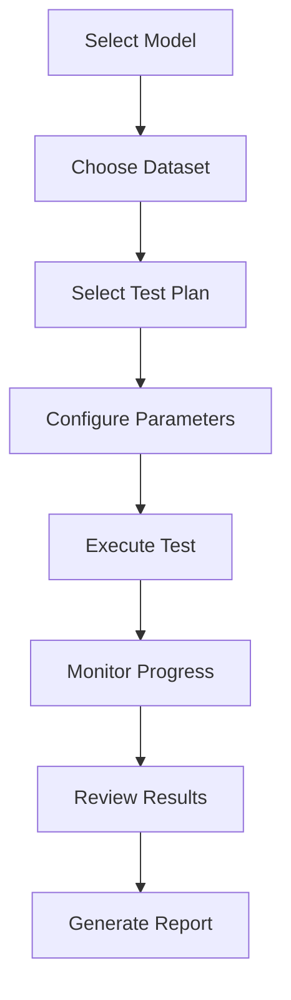

# AI Governance Operational Manual
## Oreno GRC Platform - AI Governance Module

**Version:** 2.0  
**Last Updated:** January 2025  
**Document Type:** Operational Manual  

---

## Table of Contents

1. [Overview](#overview)
2. [Getting Started](#getting-started)
3. [User Roles & Permissions](#user-roles--permissions)
4. [Core Workflows](#core-workflows)
5. [Model Management](#model-management)
6. [Dataset Management](#dataset-management)
7. [Test Planning & Execution](#test-planning--execution)
8. [Compliance & Reporting](#compliance--reporting)
9. [Security & Privacy](#security--privacy)
10. [Administration](#administration)
11. [Troubleshooting](#troubleshooting)
12. [Best Practices](#best-practices)
13. [API Reference](#api-reference)
14. [CLI Commands](#cli-commands)

---

## Overview

The AI Governance module provides comprehensive governance, risk management, and compliance capabilities for AI/ML models within the Oreno GRC platform. It enables organizations to:

- **Register and manage AI/ML models** with full lifecycle tracking
- **Execute automated compliance tests** against regulatory frameworks
- **Monitor model performance** and detect bias, drift, and security issues
- **Generate compliance reports** for auditors and regulators
- **Maintain audit trails** for all AI governance activities

### Key Features

- ✅ **Multi-tenant Architecture** - Organization-scoped data isolation
- ✅ **Compliance Frameworks** - EU AI Act, OECD Principles, NIST AI RMF
- ✅ **Automated Testing** - Fairness, Explainability, Robustness, Privacy
- ✅ **Real-time Monitoring** - Performance metrics and SLO tracking
- ✅ **Security Controls** - PII masking, encryption, data retention
- ✅ **Audit Logging** - Complete activity tracking
- ✅ **Webhook Integration** - CI/CD pipeline integration
- ✅ **REST APIs** - Programmatic access and automation

---

## Getting Started

### Prerequisites

- Access to Oreno GRC platform
- Appropriate user role (see [User Roles & Permissions](#user-roles--permissions))
- AI/ML models and datasets to register
- Understanding of compliance requirements

### First-Time Setup

1. **Access AI Governance**
   - Navigate to the main navigation bar
   - Click on **"AI Governance"**
   - You'll be taken to the AI Governance Dashboard

2. **Initial Configuration**
   - Review your organization's compliance requirements
   - Set up test plans for your model types
   - Configure connectors for model registries
   - Set up webhook endpoints for automation

3. **Register Your First Model**
   - Go to **Models** → **Add Model**
   - Fill in model details (name, type, URI, version)
   - Set security and privacy classifications
   - Save the model

---

## User Roles & Permissions

### Role Hierarchy

| Role | Permissions | Use Case |
|------|-------------|----------|
| **Admin** | Full access to all features | System administrators, compliance officers |
| **Manager** | Manage test plans, view reports, execute tests | Team leads, project managers |
| **Staff** | View models, run tests, basic operations | Data scientists, ML engineers |
| **Read-Only** | View-only access to dashboards and reports | Auditors, stakeholders |

### Permission Matrix

| Feature | Admin | Manager | Staff | Read-Only |
|---------|-------|---------|-------|-----------|
| View Dashboard | ✅ | ✅ | ✅ | ✅ |
| Register Models | ✅ | ✅ | ✅ | ❌ |
| Manage Test Plans | ✅ | ✅ | ❌ | ❌ |
| Execute Tests | ✅ | ✅ | ✅ | ❌ |
| View Test Results | ✅ | ✅ | ✅ | ✅ |
| Generate Reports | ✅ | ✅ | ✅ | ✅ |
| Manage Frameworks | ✅ | ❌ | ❌ | ❌ |
| Configure Connectors | ✅ | ❌ | ❌ | ❌ |
| Manage Webhooks | ✅ | ✅ | ❌ | ❌ |
| Security Settings | ✅ | ❌ | ❌ | ❌ |

---

## Core Workflows

### 1. Model Registration Workflow



**Step-by-Step Process:**

1. **Navigate to Models**
   - Click **"AI Governance"** in main navigation
   - Click **"Models"** in the dashboard
   - Click **"Add Model"** button

2. **Fill Model Information**
   - **Name**: Descriptive name for your model
   - **Type**: Select from Tabular, Image, or Generative
   - **URI**: Path to model file (MLflow, S3, Azure, etc.)
   - **Version**: Model version identifier
   - **Signature**: Input/output schema (JSON format)

3. **Set Security Classifications**
   - **Contains PII**: Check if model processes personal data
   - **Data Classification**: Public, Internal, Confidential, or Restricted
   - **Encryption Key ID**: If model is encrypted

4. **Save and Verify**
   - Click **"Save"** button
   - Verify model appears in the models list
   - Check that all details are correct

### 2. Test Execution Workflow



**Step-by-Step Process:**

1. **Create Test Run**
   - Go to **"Test Runs"** → **"Create Test Run"**
   - Select your model from the dropdown
   - Choose a dataset (optional)
   - Select a test plan

2. **Configure Test Parameters**
   - Set test-specific parameters
   - Configure thresholds and alerts
   - Set security classifications

3. **Execute Test**
   - Click **"Save & Run Test"** button
   - Monitor progress in the test runs list
   - View real-time status updates

4. **Review Results**
   - Click on completed test run
   - Review individual test results
   - Check metrics and thresholds
   - Download evidence artifacts

---

## Model Management

### Registering Models

#### Model Types Supported

| Type | Description | Use Cases |
|------|-------------|-----------|
| **Tabular** | Traditional ML models for structured data | Classification, regression, forecasting |
| **Image** | Computer vision models | Object detection, image classification |
| **Generative** | LLMs and generative AI models | Text generation, chatbots, content creation |

#### Model URI Formats

```bash
# MLflow Models
mlflow://models/MyModel/1
mlflow://models/MyModel/Production

# S3 Storage
s3://my-bucket/models/model-v1.pkl
s3://my-bucket/models/2024/01/model.pkl

# Azure Blob Storage
https://mystorageaccount.blob.core.windows.net/models/model.pkl

# Local File System
file:///path/to/model.pkl
/path/to/model.pkl

# HTTP/HTTPS
https://api.example.com/models/model-v1
```

#### Model Signature Format

```json
{
  "input_features": ["feature1", "feature2", "feature3"],
  "output": "prediction",
  "input_types": {
    "feature1": "float64",
    "feature2": "int64",
    "feature3": "string"
  },
  "output_type": "float64"
}
```

### Model Lifecycle Management

#### Versioning Best Practices

1. **Semantic Versioning**
   ```
   v1.0.0 - Major release
   v1.1.0 - Minor update
   v1.1.1 - Patch/bug fix
   ```

2. **Environment Tags**
   ```
   v1.0.0-dev     - Development
   v1.0.0-staging - Staging
   v1.0.0-prod    - Production
   ```

3. **Model Registry Integration**
   - Use MLflow for model versioning
   - Tag models with metadata
   - Maintain model lineage

#### Model Metadata

```json
{
  "algorithm": "RandomForest",
  "training_date": "2024-01-15",
  "accuracy": 0.95,
  "data_source": "customer_data_v2",
  "features": ["age", "income", "credit_score"],
  "target": "default_risk"
}
```

---

## Dataset Management

### Dataset Registration

#### Dataset Roles

| Role | Description | Use Case |
|------|-------------|----------|
| **Train** | Training data for model development | Model training |
| **Validation** | Validation data for model tuning | Hyperparameter optimization |
| **Test** | Test data for final evaluation | Model performance assessment |
| **Other** | Custom dataset purposes | Specialized testing |

#### Supported Formats

| Format | Description | Best For |
|--------|-------------|----------|
| **Parquet** | Columnar format, efficient | Large datasets, analytics |
| **CSV** | Comma-separated values | Small datasets, compatibility |
| **JSON** | JavaScript Object Notation | Nested data, APIs |
| **JSONL** | JSON Lines format | Streaming data, logs |

#### Dataset Schema Definition

```json
{
  "feature1": "float64",
  "feature2": "int64",
  "feature3": "string",
  "label": "int64",
  "metadata": {
    "source": "customer_database",
    "collection_date": "2024-01-15",
    "record_count": 10000
  }
}
```

### Sensitive Data Handling

#### PII Detection and Masking

The system automatically detects and masks PII in datasets:

```python
# Example PII patterns detected:
- Email addresses: user@example.com
- Phone numbers: +1-555-123-4567
- SSN: 123-45-6789
- Credit cards: 4111-1111-1111-1111
```

#### Data Classification Levels

| Level | Description | Access Control |
|-------|-------------|----------------|
| **Public** | No restrictions | Anyone |
| **Internal** | Company use only | Authenticated users |
| **Confidential** | Restricted access | Authorized personnel |
| **Restricted** | Highly sensitive | Limited access |

---

## Test Planning & Execution

### Test Plan Configuration

#### Test Categories

| Category | Description | Tools Used |
|----------|-------------|------------|
| **Fairness** | Bias detection and mitigation | Fairlearn, Aequitas |
| **Explainability** | Model interpretability | SHAP, LIME, Captum |
| **Robustness** | Adversarial attack resistance | Foolbox, Adversarial Robustness Toolbox |
| **Privacy** | Data privacy protection | Differential Privacy, PII masking |
| **Performance** | Model accuracy and efficiency | Custom metrics, benchmarking |

#### Test Plan JSON Configuration

```json
{
  "tests": {
    "fairness_test": {
      "enabled": true,
      "parameters": {
        "sensitive_attribute": "gender",
        "metric": "demographic_parity",
        "threshold": 0.8
      },
      "thresholds": {
        "demographic_parity": 0.8,
        "equalized_odds": 0.75
      },
      "timeout": 300,
      "metadata": {
        "description": "Check for gender bias in predictions"
      }
    },
    "explainability_test": {
      "enabled": true,
      "parameters": {
        "method": "shap",
        "sample_size": 100,
        "feature_importance_threshold": 0.1
      },
      "thresholds": {
        "explainability_score": 0.7
      },
      "timeout": 600
    }
  },
  "alert_rules": {
    "email_alerts": true,
    "threshold_breach": true,
    "test_failure": true
  }
}
```

### Test Execution

#### Execution Modes

1. **Synchronous Execution**
   - Immediate test execution
   - Real-time progress updates
   - Suitable for small datasets

2. **Asynchronous Execution**
   - Background test execution
   - Email/webhook notifications
   - Suitable for large datasets

#### Test Parameters

```json
{
  "sample_size": 1000,
  "random_seed": 42,
  "confidence_level": 0.95,
  "timeout": 1800,
  "parallel_workers": 4
}
```

### Test Results Analysis

#### Result Interpretation

| Status | Description | Action Required |
|--------|-------------|-----------------|
| **Passed** | Test met all thresholds | None |
| **Failed** | Test failed thresholds | Review and fix |
| **Warning** | Test passed but with concerns | Monitor closely |
| **Error** | Test execution failed | Debug and retry |

#### Metrics and Thresholds

```json
{
  "accuracy": {
    "value": 0.95,
    "threshold": 0.90,
    "passed": true
  },
  "demographic_parity": {
    "value": 0.85,
    "threshold": 0.80,
    "passed": true
  },
  "explainability_score": {
    "value": 0.75,
    "threshold": 0.70,
    "passed": true
  }
}
```

---

## Compliance & Reporting

### Compliance Frameworks

#### EU AI Act Compliance

The system supports EU AI Act requirements:

| Risk Level | Requirements | Tests Applied |
|------------|--------------|---------------|
| **Minimal Risk** | Basic transparency | Documentation, labeling |
| **Limited Risk** | Transparency obligations | User notification, opt-out |
| **High Risk** | Conformity assessment | Comprehensive testing |
| **Unacceptable Risk** | Prohibited practices | Automated detection |

#### OECD AI Principles

1. **Inclusive Growth** - AI should benefit people and the planet
2. **Human-Centered Values** - AI should respect human rights
3. **Transparency** - AI systems should be explainable
4. **Robustness** - AI should be secure and safe
5. **Accountability** - Clear responsibility for AI outcomes

#### NIST AI RMF

The NIST AI Risk Management Framework provides:

- **Governance** - Policies and procedures
- **Mapping** - Risk identification and assessment
- **Measurement** - Performance monitoring
- **Management** - Risk mitigation strategies

### Report Generation

#### Available Reports

1. **Dashboard Report**
   - Executive summary
   - Key metrics and trends
   - Compliance status overview

2. **Test Run Details**
   - Individual test results
   - Performance metrics
   - Evidence artifacts

3. **Compliance Matrix**
   - Framework mapping
   - Requirement coverage
   - Gap analysis

#### Report Formats

| Format | Use Case | Features |
|--------|----------|----------|
| **PDF** | Official documentation | Professional formatting, signatures |
| **Word** | Editable reports | Customizable content |
| **Excel** | Data analysis | Pivot tables, charts |
| **JSON** | API integration | Machine-readable format |

#### Report Scheduling

```bash
# Generate weekly compliance report
python manage.py generate_compliance_report --organization=1 --frequency=weekly

# Generate monthly dashboard report
python manage.py generate_dashboard_report --organization=1 --frequency=monthly
```

---

## Security & Privacy

### Data Protection

#### Encryption

All sensitive data is encrypted using:

- **AES-256** for data at rest
- **TLS 1.3** for data in transit
- **Key rotation** every 90 days
- **Hardware Security Modules** (HSM) for key management

#### PII Masking

Automatic PII detection and masking:

```python
# Before masking
"Contact John Doe at john.doe@example.com or call +1-555-123-4567"

# After masking
"Contact [NAME] at [EMAIL] or call [PHONE]"
```

#### Data Retention

| Data Type | Retention Period | Auto-Delete |
|-----------|------------------|-------------|
| **Test Results** | 7 years | Yes |
| **Model Metadata** | 10 years | Yes |
| **Audit Logs** | 7 years | Yes |
| **PII Data** | 3 years | Yes |

### Access Control

#### Authentication

- **Multi-factor Authentication** (MFA) required
- **Single Sign-On** (SSO) integration
- **Session timeout** after 8 hours
- **Password complexity** requirements

#### Authorization

```python
# Permission checks
if user.has_perm('ai_governance.view_modelasset'):
    # Allow model viewing
    
if user.has_perm('ai_governance.execute_testrun'):
    # Allow test execution
```

### Audit Logging

#### Logged Activities

- Model registration and updates
- Test execution and results
- User access and permissions
- Data exports and downloads
- Configuration changes

#### Audit Log Format

```json
{
  "timestamp": "2024-01-15T10:30:00Z",
  "user": "john.doe@company.com",
  "action": "model_created",
  "resource": "ModelAsset",
  "resource_id": 123,
  "details": {
    "model_name": "CustomerRiskModel",
    "model_type": "tabular"
  },
  "ip_address": "192.168.1.100",
  "user_agent": "Mozilla/5.0..."
}
```

---

## Administration

### System Configuration

#### Environment Variables

```bash
# AI Governance Settings
AI_GOVERNANCE_ENABLED=true
AI_GOVERNANCE_QUEUE_PREFIX=ai_gov
AI_GOVERNANCE_CACHE_TTL=3600
AI_GOVERNANCE_MAX_CONCURRENT_TESTS=5

# Security Settings
AI_GOVERNANCE_ENCRYPTION_KEY_ID=key-123
AI_GOVERNANCE_PII_MASKING_ENABLED=true
AI_GOVERNANCE_DATA_RETENTION_DAYS=2555

# Performance Settings
AI_GOVERNANCE_SAMPLE_SIZE_LIMIT=10000
AI_GOVERNANCE_TEST_TIMEOUT=1800
AI_GOVERNANCE_CACHE_SIZE=1000
```

#### Database Configuration

```python
# settings.py
DATABASES = {
    'default': {
        'ENGINE': 'django.db.backends.postgresql',
        'NAME': 'oreno_grc',
        'USER': 'oreno_user',
        'PASSWORD': 'secure_password',
        'HOST': 'localhost',
        'PORT': '5432',
    }
}
```

### Monitoring and Alerting

#### Health Checks

```bash
# Check system health
python manage.py check_ai_governance_health

# Monitor test execution
python manage.py monitor_test_execution --organization=1

# Check compliance status
python manage.py check_compliance_status --organization=1
```

#### Alert Configuration

```json
{
  "email_alerts": {
    "enabled": true,
    "recipients": ["admin@company.com"],
    "events": ["test_failure", "threshold_breach"]
  },
  "webhook_alerts": {
    "enabled": true,
    "url": "https://hooks.slack.com/services/...",
    "events": ["test_completed", "compliance_violation"]
  }
}
```

### Backup and Recovery

#### Backup Strategy

1. **Database Backups**
   ```bash
   # Daily automated backups
   pg_dump oreno_grc > backup_$(date +%Y%m%d).sql
   ```

2. **File System Backups**
   ```bash
   # Backup model files and artifacts
   rsync -av /path/to/models/ /backup/models/
   ```

3. **Configuration Backups**
   ```bash
   # Backup configuration files
   tar -czf config_backup.tar.gz /path/to/config/
   ```

#### Recovery Procedures

1. **Database Recovery**
   ```bash
   # Restore from backup
   psql oreno_grc < backup_20240115.sql
   ```

2. **File Recovery**
   ```bash
   # Restore model files
   rsync -av /backup/models/ /path/to/models/
   ```

---

## Troubleshooting

### Common Issues

#### 1. Test Execution Failures

**Problem**: Tests fail to execute or timeout

**Solutions**:
```bash
# Check Celery worker status
celery -A oreno status

# Restart Celery workers
celery -A oreno restart

# Check test logs
tail -f /var/log/ai_governance/tests.log
```

#### 2. Model Loading Errors

**Problem**: Cannot load model from URI

**Solutions**:
```bash
# Verify model URI accessibility
curl -I https://api.example.com/models/model-v1

# Check MLflow connection
mlflow models serve -m mlflow://models/MyModel/1

# Test S3 access
aws s3 ls s3://my-bucket/models/
```

#### 3. Permission Denied Errors

**Problem**: Users cannot access AI Governance features

**Solutions**:
```bash
# Check user permissions
python manage.py shell
>>> from django.contrib.auth import get_user_model
>>> User = get_user_model()
>>> user = User.objects.get(email='user@company.com')
>>> user.has_perm('ai_governance.view_modelasset')

# Grant permissions
python manage.py grant_ai_governance_permissions --user=user@company.com --role=staff
```

#### 4. Performance Issues

**Problem**: Slow test execution or dashboard loading

**Solutions**:
```bash
# Check database performance
python manage.py dbshell
>>> EXPLAIN ANALYZE SELECT * FROM ai_governance_testrun;

# Optimize database indexes
python manage.py optimize_ai_governance_indexes

# Clear cache
python manage.py clear_cache
```

### Error Codes

| Code | Description | Solution |
|------|-------------|----------|
| **AG001** | Model URI not accessible | Check URI and network connectivity |
| **AG002** | Test timeout | Increase timeout or reduce dataset size |
| **AG003** | Insufficient permissions | Grant appropriate user permissions |
| **AG004** | Dataset format error | Validate dataset format and schema |
| **AG005** | Framework not found | Ensure compliance frameworks are seeded |

### Log Analysis

#### Log Locations

```bash
# Application logs
/var/log/ai_governance/application.log

# Test execution logs
/var/log/ai_governance/tests.log

# Security logs
/var/log/ai_governance/security.log

# Performance logs
/var/log/ai_governance/performance.log
```

#### Log Analysis Commands

```bash
# Find test failures
grep "ERROR" /var/log/ai_governance/tests.log

# Monitor real-time logs
tail -f /var/log/ai_governance/application.log

# Search for specific errors
grep "AG001" /var/log/ai_governance/application.log
```

---

## Best Practices

### Model Development

1. **Version Control**
   - Use semantic versioning
   - Tag releases in model registry
   - Maintain model lineage

2. **Documentation**
   - Document model purpose and limitations
   - Include training data information
   - Specify performance metrics

3. **Testing**
   - Test on diverse datasets
   - Validate against edge cases
   - Monitor for data drift

### Compliance Management

1. **Framework Alignment**
   - Map tests to regulatory requirements
   - Maintain compliance documentation
   - Regular compliance assessments

2. **Risk Assessment**
   - Identify high-risk models
   - Implement appropriate controls
   - Monitor risk indicators

3. **Audit Preparation**
   - Maintain audit trails
   - Document decision processes
   - Prepare compliance reports

### Security Practices

1. **Data Protection**
   - Classify data appropriately
   - Implement encryption
   - Regular security assessments

2. **Access Control**
   - Principle of least privilege
   - Regular access reviews
   - Multi-factor authentication

3. **Incident Response**
   - Document incident procedures
   - Regular security training
   - Test incident response plans

### Performance Optimization

1. **Resource Management**
   - Monitor resource usage
   - Optimize test execution
   - Implement caching strategies

2. **Scalability**
   - Design for horizontal scaling
   - Use asynchronous processing
   - Implement load balancing

3. **Monitoring**
   - Set up comprehensive monitoring
   - Define performance baselines
   - Implement alerting

---

## API Reference

### Authentication

All API requests require authentication:

```bash
# Using API token
curl -H "Authorization: Token your-api-token" \
     https://api.oreno.com/ai-governance/api/models/

# Using session authentication
curl -H "Cookie: sessionid=your-session-id" \
     https://api.oreno.com/ai-governance/api/models/
```

### Model Management API

#### List Models

```bash
GET /ai-governance/api/models/
```

**Response**:
```json
{
  "count": 10,
  "next": null,
  "previous": null,
  "results": [
    {
      "id": 1,
      "name": "CustomerRiskModel",
      "model_type": "tabular",
      "uri": "mlflow://models/CustomerRisk/1",
      "version": "1.0.0",
      "created_at": "2024-01-15T10:30:00Z"
    }
  ]
}
```

#### Create Model

```bash
POST /ai-governance/api/models/
Content-Type: application/json

{
  "name": "NewModel",
  "model_type": "tabular",
  "uri": "s3://bucket/models/model.pkl",
  "version": "1.0.0",
  "signature": {
    "input_features": ["feature1", "feature2"],
    "output": "prediction"
  }
}
```

#### Get Model Details

```bash
GET /ai-governance/api/models/{id}/
```

### Test Execution API

#### Create Test Run

```bash
POST /ai-governance/api/test-runs/
Content-Type: application/json

{
  "model_asset": 1,
  "dataset_asset": 2,
  "test_plan": 1,
  "parameters": {
    "sample_size": 1000,
    "confidence_level": 0.95
  }
}
```

#### Get Test Results

```bash
GET /ai-governance/api/test-runs/{id}/results/
```

### Webhook API

#### Test Webhook

```bash
POST /ai-governance/api/webhooks/{id}/test/
```

**Webhook Payload Example**:
```json
{
  "event": "test_run.completed",
  "timestamp": "2024-01-15T10:30:00Z",
  "data": {
    "test_run_id": 123,
    "model_name": "CustomerRiskModel",
    "status": "completed",
    "results": {
      "passed_tests": 8,
      "failed_tests": 1,
      "total_tests": 9
    }
  }
}
```

---

## CLI Commands

### Model Management

#### Register Model

```bash
# Register a new model
python manage.py register_model \
  --name="CustomerRiskModel" \
  --type="tabular" \
  --uri="mlflow://models/CustomerRisk/1" \
  --version="1.0.0" \
  --organization=1

# Register with security settings
python manage.py register_model \
  --name="PIIModel" \
  --type="tabular" \
  --uri="s3://bucket/models/pii-model.pkl" \
  --contains-pii \
  --data-classification="confidential" \
  --organization=1
```

#### List Models

```bash
# List all models
python manage.py list_models --organization=1

# List models by type
python manage.py list_models --type="tabular" --organization=1

# List models with PII
python manage.py list_models --contains-pii --organization=1
```

### Test Execution

#### Run Tests

```bash
# Execute test run
python manage.py trigger_test_run \
  --model=1 \
  --dataset=2 \
  --test-plan=1 \
  --organization=1

# Execute with custom parameters
python manage.py trigger_test_run \
  --model=1 \
  --test-plan=1 \
  --parameters='{"sample_size": 5000}' \
  --organization=1
```

#### Monitor Test Execution

```bash
# Check test status
python manage.py check_test_status --test-run=123

# Monitor all running tests
python manage.py monitor_tests --organization=1

# Get test results
python manage.py get_test_results --test-run=123
```

### Compliance Management

#### Seed Frameworks

```bash
# Seed all compliance frameworks
python manage.py seed_frameworks --organization=1

# Seed specific framework
python manage.py seed_frameworks --framework="EU_AI_ACT" --organization=1
```

#### Generate Compliance Reports

```bash
# Generate dashboard report
python manage.py generate_dashboard_report \
  --organization=1 \
  --format="pdf" \
  --output="dashboard_report.pdf"

# Generate compliance matrix
python manage.py generate_compliance_matrix \
  --organization=1 \
  --framework="EU_AI_ACT" \
  --format="excel"
```

### Security and Privacy

#### Security Audit

```bash
# Run security audit
python manage.py security_audit --organization=1

# GDPR compliance check
python manage.py gdpr_compliance_check --organization=1

# PII audit
python manage.py pii_audit --organization=1 --mask-pii
```

#### Data Retention

```bash
# Cleanup expired data
python manage.py data_retention_cleanup \
  --organization=1 \
  --data-type="test_runs" \
  --dry-run

# Force cleanup
python manage.py data_retention_cleanup \
  --organization=1 \
  --data-type="all" \
  --force
```

### Performance Monitoring

#### Performance Metrics

```bash
# Get performance metrics
python manage.py monitor_performance --organization=1

# Check SLO compliance
python manage.py check_slo_compliance --organization=1

# Generate performance report
python manage.py generate_performance_report \
  --organization=1 \
  --period="last_30_days"
```

#### Cache Management

```bash
# Clear cache
python manage.py clear_cache --organization=1

# Invalidate specific cache
python manage.py invalidate_cache \
  --cache-key="dashboard_metrics" \
  --organization=1
```

### UAT and Testing

#### Run UAT Suite

```bash
# Run comprehensive UAT
python manage.py uat_test_suite --organization=1

# Run specific UAT category
python manage.py uat_test_suite \
  --category="functional" \
  --organization=1

# Generate UAT data
python manage.py generate_uat_data \
  --organization=1 \
  --data-size="large"
```

#### Usability Testing

```bash
# Run usability checks
python manage.py usability_check --organization=1

# Acceptance criteria validation
python manage.py acceptance_criteria_validation \
  --organization=1 \
  --criteria-category="all"
```

---

## Support and Resources

### Getting Help

1. **Documentation**: This manual and inline help
2. **Support Team**: ai-governance-support@oreno.com
3. **Community Forum**: https://community.oreno.com
4. **Knowledge Base**: https://kb.oreno.com/ai-governance

### Training Resources

1. **Video Tutorials**: https://training.oreno.com/ai-governance
2. **Webinars**: Monthly training sessions
3. **Certification**: AI Governance Professional certification
4. **Best Practices Guide**: https://docs.oreno.com/best-practices

### Updates and Maintenance

- **Monthly Updates**: New features and improvements
- **Quarterly Reviews**: Compliance framework updates
- **Annual Assessments**: Security and performance reviews
- **Emergency Patches**: Critical security fixes

---

**Document Information**

- **Version**: 2.0
- **Last Updated**: January 2025
- **Next Review**: April 2025
- **Owner**: AI Governance Team
- **Approved By**: Chief Technology Officer

---

*This manual is a living document and will be updated regularly to reflect new features, best practices, and regulatory requirements. For the most current version, please visit the Oreno GRC documentation portal.*
